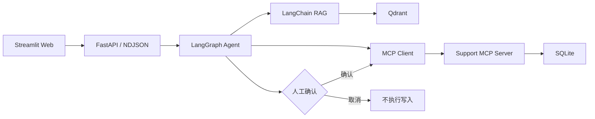

# SupportPilot AI

SupportPilot AI 是面向企业售后的智能客服 Agent：使用 LangGraph 编排工作流，结合 LangChain RAG 与 MCP 业务工具，完成“查政策 → 查订单 → 判断资格 → 人工确认 → 创建工单”的闭环。

> An AI customer support agent powered by LangGraph, LangChain RAG, Qdrant, and MCP, featuring cited answers, business tool integration, and human-approved ticket operations.

项目支持 DeepSeek 等 OpenAI-compatible 模型，也可以完全离线运行。当前版本：`v1.0.0`。

## 核心演示

输入：

> 订单 A1024 延迟五天，按政策是否可以补偿？

Agent 会：

1. 从 Qdrant 检索售后补偿政策，并返回文件名、页码和相关性分数。
2. 通过 MCP 查询订单的延迟天数与客户等级。
3. 综合判断金卡客户可获得 50 元代金券。
4. 用户要求创建工单时先展示待确认操作，确认后才执行写入。

推荐继续测试：

```text
帮我为这个订单创建补偿工单
查看这个订单的历史工单
```

## 技术架构



详细设计见 [docs/ARCHITECTURE.md](docs/ARCHITECTURE.md)。

如果希望从概念到源码系统学习本项目，请阅读 [docs/LEARNING_GUIDE.md](docs/LEARNING_GUIDE.md)。

## 已完成功能

- PDF、Markdown、TXT 导入、切分和 Qdrant 索引
- 向量相似度与词项覆盖率混合重排，按阈值过滤无关引用
- `knowledge`、`business`、`combined`、`create_ticket` 路由
- `get_order`、`get_customer`、`list_tickets`、`create_ticket` MCP 工具
- 写操作人工确认、取消和防重复执行
- 会话内订单号指代、流式回答、引用和工具轨迹展示
- LLM、MCP 异常降级，请求 ID、耗时日志和友好错误提示
- 离线评估、单元/API/MCP 集成测试和端到端冒烟测试
- 本地一键启动和 Docker Compose 健康检查

## 快速启动

要求 Python 3.11+。

```powershell
python -m venv .venv
.\.venv\Scripts\Activate.ps1
python -m pip install -e ".[dev]"
Copy-Item .env.example .env
```

### 配置 DeepSeek

已有 DeepSeek 官方 API 余额、希望对话使用 DeepSeek 而 Embedding 使用百炼时，
参见 [DeepSeek 对话 + 百炼 Embedding 搭建指南](docs/DEEPSEEK_SETUP.md)
和 `.env.deepseek.example`。两家服务的地址与密钥可以独立配置。

使用阿里云百炼同时提供对话和 Embedding、数据库保留本机的配置，见
[百炼本地开发搭建指南](docs/BAILIAN_SETUP.md) 和 `.env.bailian.example`。


编辑项目根目录的 `.env`：

```dotenv
MODEL_PROVIDER=openai
OPENAI_API_KEY=your-deepseek-key
OPENAI_BASE_URL=https://api.deepseek.com/
CHAT_MODEL=deepseek-chat

# 演示环境默认使用无需额外 Key 的本地 Hash Embeddings
EMBEDDING_PROVIDER=hash
```

不要把 `.env` 提交到 GitHub；仓库只保留不含密钥的 `.env.example`。

### 一键运行

```powershell
.\scripts\start_all.ps1
```

脚本会后台启动 MCP、API 和 Web，已运行的服务会被复用：

- Web：<http://127.0.0.1:8501>
- API 文档：<http://127.0.0.1:8000/docs>
- API 健康检查：<http://127.0.0.1:8000/health>
- MCP：<http://127.0.0.1:8001/mcp>

日志位于 `.data/logs/`。

也可以分别运行 `scripts/run_mcp.ps1`、`scripts/run_api.ps1` 和 `scripts/run_web.ps1`。

## Docker Compose

```powershell
Copy-Item .env.example .env
docker compose up --build
```

Docker 模式使用独立 Qdrant 服务；API 会等待 MCP 健康后启动，Web 会等待 API 健康后启动。

## 测试与评估

```powershell
$env:PYTHONPATH="src"
.\.venv\Scripts\python.exe -m pytest -q
.\.venv\Scripts\python.exe -m support_pilot.evaluation
.\.venv\Scripts\python.exe scripts/e2e_smoke.py
```

评估覆盖检索命中率、Top-1 准确率、MRR、平均引用数和路由准确率。可复现结果见 [evaluations/RESULTS.md](evaluations/RESULTS.md)，完整 JSON 写入 `.data/evaluation.json`。

## 主要配置

| 变量 | 默认值 | 说明 |
|---|---|---|
| `MODEL_PROVIDER` | `offline` | `offline` 或 `openai` |
| `OPENAI_BASE_URL` | 空 | OpenAI-compatible API 地址 |
| `CHAT_MODEL` | `gpt-4.1-mini` | 对话模型名称 |
| `MODEL_ROUTING_ENABLED` | `false` | 是否使用模型路由；默认规则路由更稳定、低延迟 |
| `EMBEDDING_PROVIDER` | `hash` | `hash` 或 `openai` |
| `QDRANT_URL` | 空 | 空时使用本地磁盘模式 |
| `MCP_URL` | `http://127.0.0.1:8001/mcp` | MCP Streamable HTTP 地址 |
| `TOP_K` | `5` | 初始检索候选数 |
| `MAX_CITATIONS` | `2` | 最终返回的最大引用数 |
| `RELEVANCE_RATIO` | `0.6` | 相对最佳结果的过滤比例 |
| `MAX_UPLOAD_MB` | `10` | 单个上传文件大小限制 |

## 项目结构

```text
src/support_pilot/
├── agent.py           # LangGraph 工作流与人工确认
├── api.py             # FastAPI、流式接口和请求日志
├── business.py        # MCP 客户端与本地测试网关
├── evaluation.py      # 离线评估与报告生成
├── knowledge.py       # 文档加载、Qdrant 和混合重排
├── mcp_server.py      # 业务 MCP Server
├── model_gateway.py   # LLM 路由、回答和失败降级
├── repository.py      # SQLite 模拟业务系统
└── ui.py              # Streamlit UI
```

## 简历描述示例

> 设计并实现企业售后智能 Agent，基于 LangGraph 编排 RAG 检索与 MCP 工具调用；支持多格式知识入库、混合重排、可追溯引用、订单查询及 Human-in-the-loop 工单写入，并通过离线评估、自动化测试和 Docker Compose 验证完整链路。

## 项目边界

当前业务数据为 SQLite 演示数据，Hash Embeddings 适合离线演示而非大规模生产。真实上线还需要接入企业身份权限、真实 CRM、审计存储、专用 Embedding/Reranker、监控告警和多实例会话存储。
