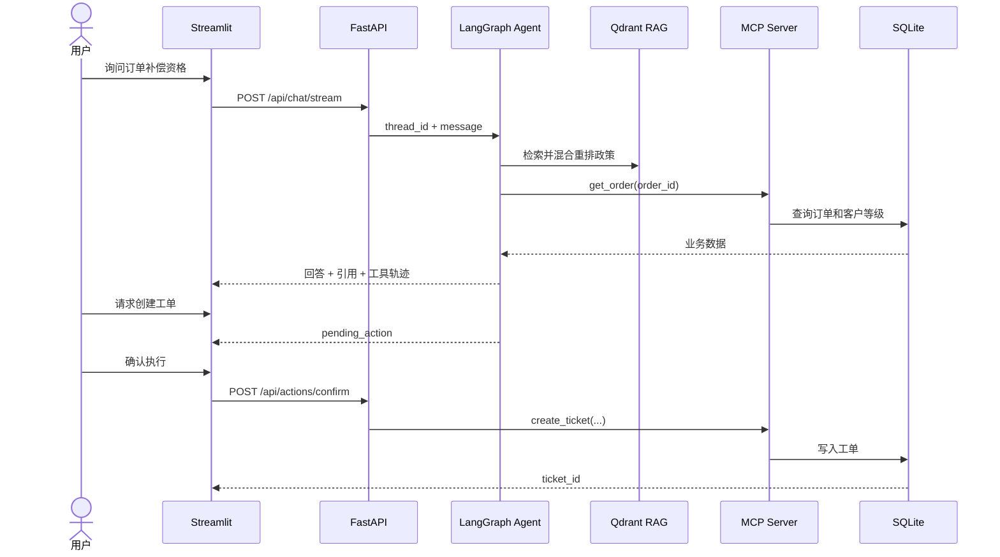

# SupportPilot 架构设计

## 请求链路

## 关键设计

### 路由

Agent 将请求分为知识查询、业务查询、组合查询、创建工单和信息补充五类。明确的写操作意图由确定性规则兜底，避免模型绕过确认流程。

### 检索

先从 Qdrant 获取 `TOP_K` 个候选，再结合向量相似度与查询词项覆盖率重排。低于最佳结果相对阈值的片段会被过滤，最终最多返回 `MAX_CITATIONS` 条引用。

### 写操作安全

`create_ticket` 不在普通聊天流程中直接执行。Agent 只生成带唯一 ID 的 `pending_action`；确认接口校验当前会话和动作 ID 后执行一次写入。确认或取消后动作失效。

### 失败降级

- LLM 路由失败：回退到确定性路由。
- LLM 回答失败：基于检索和业务数据生成离线回答。
- MCP 查询失败：保留错误工具轨迹并提示稍后重试或转人工。
- MCP 写入失败：不清除待确认动作，允许重试或取消。

## 生产化差距

- 当前会话状态保存在 API 进程内存中，不支持多实例共享。
- 演示数据库没有用户身份、细粒度权限和完整审计表。
- 本地 Hash Embeddings 不替代生产级中文向量模型与 Reranker。
- 需要增加指标采集、集中日志、限流、密钥托管和数据脱敏。
