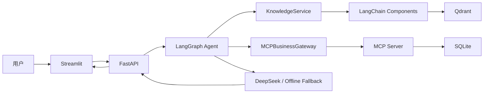
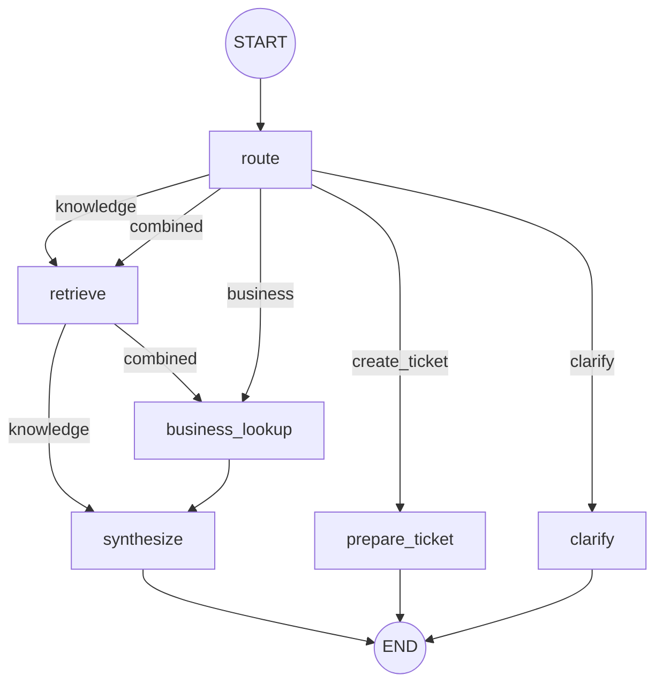

# SupportPilot AI 项目学习指南

这份指南用于帮助你从“项目能运行”走到“能够解释设计、修改代码并应对面试追问”。建议一边阅读，一边打开对应源码。

## 1. 学完后应该掌握什么

完成本指南后，你应该能够：

- 解释 LangChain、LangGraph、RAG、MCP 各自解决什么问题。
- 说清一次用户请求如何经过 Web、API、Agent、RAG、MCP 和数据库。
- 独立增加一种 Agent 路由或一个 MCP 工具。
- 解释为什么创建工单必须经过人工确认。
- 使用测试和离线评估证明项目有效，而不只是展示页面。

## 2. 先理解四个核心概念

### 2.1 RAG：先查资料，再让模型回答

RAG 是 Retrieval-Augmented Generation，即检索增强生成。它不是框架，也不是训练模型，而是一种应用流程：

```text
业务文档 → 切分 → 向量化 → 向量库
                            ↑
用户问题 → 向量化 → 检索相关片段 → 连同问题交给 LLM → 有依据的回答
```

普通 LLM 只依赖训练时学到的知识，无法天然知道企业内部政策。RAG 把检索出来的内部资料放进上下文，使回答可以基于当前文档，并附带来源。

本项目中：

- 原始文档：`data/knowledge/`
- 文档处理与检索：[knowledge.py](../src/support_pilot/knowledge.py)
- 向量数据库：Qdrant
- 检索结果模型：`Citation`

### 2.2 LangChain：提供可组合的 AI 应用组件

LangChain 在本项目中不是“完整 Agent”，而是底层组件集合，主要提供：

- `Document`：统一表示文档内容和元数据。
- `RecursiveCharacterTextSplitter`：切分长文档。
- `Embeddings`：统一向量模型接口。
- `QdrantVectorStore`：连接 Qdrant。
- `ChatOpenAI`：连接 DeepSeek 等 OpenAI-compatible 模型。
- `SystemMessage`、`HumanMessage`：组织模型消息。
- `MultiServerMCPClient`：通过适配器把 MCP 工具接入 LangChain 生态。

对应代码：

- [knowledge.py](../src/support_pilot/knowledge.py)
- [embeddings.py](../src/support_pilot/embeddings.py)
- [model_gateway.py](../src/support_pilot/model_gateway.py)
- [business.py](../src/support_pilot/business.py)

### 2.3 LangGraph：编排有状态、可分支的 Agent 工作流

LangGraph 解决的是流程编排问题。它把 Agent 表示成一张图：

- State：节点之间传递的数据。
- Node：执行检索、业务查询或生成回答的函数。
- Edge：节点之间的执行顺序。
- Conditional Edge：根据路由结果选择不同分支。

本项目没有使用一个不可见的通用 ReAct 循环，而是显式定义流程。这样更容易测试，也能严格控制写操作。

核心代码：[agent.py](../src/support_pilot/agent.py)

### 2.4 MCP：Agent 调用外部工具的标准协议

MCP 是 Model Context Protocol。它规定服务端如何暴露工具、客户端如何发现工具，以及参数和结果如何传输。

MCP 不负责生成回答，也不等于 Agent。它在本项目中的职责是把业务系统能力标准化：

```text
Agent → MCP Client → MCP Server → SQLite 业务数据
```

服务端工具：

- `get_order`
- `get_customer`
- `list_tickets`
- `create_ticket`

对应代码：

- MCP Server：[mcp_server.py](../src/support_pilot/mcp_server.py)
- MCP Client：[business.py](../src/support_pilot/business.py)
- 模拟业务数据库：[repository.py](../src/support_pilot/repository.py)

### 2.5 四者的关系

| 技术 | 在项目中的职责 | 不负责什么 |
|---|---|---|
| RAG | 从企业文档中找到回答依据 | 不负责业务写入和流程编排 |
| LangChain | 提供模型、文档、切分、向量库等组件 | 不决定完整业务流程 |
| LangGraph | 编排路由、检索、工具调用、确认和回答 | 不定义工具通信协议 |
| MCP | 标准化业务工具发现和调用 | 不负责检索文档或生成答案 |

一句话概括：**LangGraph 编排 Agent，Agent 使用 LangChain 完成 RAG，并通过 MCP 调用业务系统。**

## 3. 项目总体架构



运行时有三个独立服务：

| 服务 | 默认端口 | 入口 |
|---|---:|---|
| Web | 8501 | [ui.py](../src/support_pilot/ui.py) |
| Agent API | 8000 | [api.py](../src/support_pilot/api.py) |
| MCP Server | 8001 | [mcp_server.py](../src/support_pilot/mcp_server.py) |

`scripts/start_all.py` 会检查端口，启动缺失的服务并等待健康状态。

## 4. 跟踪一次完整请求

以这个问题为例：

```text
订单 A1024 延迟五天，按政策是否可以补偿？
```

### 第一步：Web 发送请求

[ui.py](../src/support_pilot/ui.py) 把 `thread_id` 和用户消息发送给：

```http
POST /api/chat/stream
Content-Type: application/json

{
  "thread_id": "会话 ID",
  "message": "订单 A1024 延迟五天，按政策是否可以补偿？"
}
```

`thread_id` 用于保存会话里的最近订单号和待确认动作。

### 第二步：FastAPI 调用 Agent

[api.py](../src/support_pilot/api.py) 中的 `chat_stream()` 调用：

```python
response = await agent_service(request).chat(
    payload.thread_id,
    payload.message,
)
```

API 自身不判断问题类型，只负责参数校验、调用 Agent 和序列化响应。

### 第三步：Agent 路由

[model_gateway.py](../src/support_pilot/model_gateway.py) 的 `heuristic_route()` 检测：

- 消息包含订单号 `A1024`，需要业务数据。
- 消息包含“政策”和“补偿”，需要知识库。
- 两者同时存在，因此路由为 `combined`。

默认采用确定性规则路由，因为它速度快、结果稳定，并避免部分 OpenAI-compatible 服务不支持结构化输出的问题。配置 `MODEL_ROUTING_ENABLED=true` 后可以尝试模型路由；失败时仍会回退到规则路由。

### 第四步：LangGraph 走组合分支

[agent.py](../src/support_pilot/agent.py) 中图的主要路径是：

```text
START
  ↓
route
  ↓ combined
retrieve
  ↓
business_lookup
  ↓
synthesize
  ↓
END
```

`retrieve` 查政策，`business_lookup` 查订单，`synthesize` 把两类数据交给模型。

### 第五步：RAG 检索政策

`KnowledgeService.retrieve()` 返回类似：

```json
{
  "source": "售后补偿政策.md",
  "page": 1,
  "chunk_id": "0001-...",
  "content": "延迟 3 至 6 天时……金卡及 VIP 客户补偿 50 元代金券。",
  "score": 0.49
}
```

### 第六步：通过 MCP 查询订单

`AgentService._business_lookup()` 调用：

```python
result = await self.business.get_order("A1024")
```

生产路径中的 `self.business` 是 `MCPBusinessGateway`。它先从 MCP Server 动态发现工具，再调用 `get_order`。MCP Server 最终查询 SQLite，返回：

```json
{
  "found": true,
  "id": "A1024",
  "status": "delayed",
  "delay_days": 5,
  "customer_tier": "gold"
}
```

### 第七步：DeepSeek 综合回答

`ModelGateway.answer()` 把以下内容组织成 Prompt：

- 用户问题
- RAG 检索片段
- MCP 业务数据
- 最近的用户消息
- 不编造、必须引用的约束

模型得到两个互补事实：

- 政策规定金卡客户延迟 3～6 天补偿 50 元。
- A1024 确实延迟 5 天，客户等级为 gold。

因此可以得出带引用的结论。如果 DeepSeek 请求失败，代码会调用 `_offline_answer()`，保证演示仍能返回基于现有数据的保守答案。

## 5. RAG 的实际代码设计

### 5.1 文档加载

[knowledge.py](../src/support_pilot/knowledge.py) 的 `_load_file()` 支持：

- Markdown：UTF-8 文本读取。
- TXT：UTF-8 文本读取。
- PDF：使用 `PdfReader` 按页提取文本。

每个 `Document` 都保存：

```python
Document(
    page_content=content,
    metadata={"source": path.name, "page": number},
)
```

引用中的文件名和页码就来自这里。元数据必须在切分前保存，否则最终回答无法追溯来源。

### 5.2 文档切分

`load_documents()` 使用：

```python
RecursiveCharacterTextSplitter(
    chunk_size=700,
    chunk_overlap=100,
    separators=["\n## ", "\n# ", "\n\n", "。", "\n", " "],
)
```

设计考虑：

- `chunk_size=700`：一个片段保留相对完整的政策语义。
- `chunk_overlap=100`：减少关键信息刚好被切断的问题。
- 优先按 Markdown 标题和段落切分，再退化到句号和空格。
- `chunk_id` 由序号和内容 SHA-1 摘要组成，便于定位片段。

片段不是越小越好。太小会丢上下文，太大则会引入无关内容，并占用更多模型上下文。

### 5.3 Embedding

[embeddings.py](../src/support_pilot/embeddings.py) 实现了 `HashEmbeddings`：

```python
class HashEmbeddings(Embeddings):
    def embed_documents(self, texts): ...
    def embed_query(self, text): ...
```

它使用英文 token、中文单字和中文 bigram 进行 feature hashing，然后归一化向量。优点是：

- 不需要额外 API Key。
- 不下载模型。
- 完全确定，适合自动化测试和离线演示。

缺点是语义能力弱，不适合大型生产知识库。生产环境可以通过 `.env` 切换：

```dotenv
EMBEDDING_PROVIDER=openai
EMBEDDING_MODEL=text-embedding-3-small
```

如果使用 DeepSeek，需要注意其聊天接口不一定提供 Embedding API，因此 Embedding 可以使用另一个兼容服务。

### 5.4 Qdrant 索引

`KnowledgeService.rebuild()` 的流程：

1. 加载并切分所有文档。
2. 删除旧 collection。
3. 按 Embedding 维度创建 collection。
4. 为每个片段生成稳定 UUID。
5. 使用 `QdrantVectorStore.add_documents()` 写入。

本地模式将数据保存在 `.data/qdrant`，Docker 模式通过 `QDRANT_URL` 使用独立 Qdrant 服务。

当前上传后会重建整个索引，逻辑简单且适合小型演示库。大规模系统应改成增量索引，并维护文档版本和删除状态。

### 5.5 混合重排和引用过滤

只依赖 Hash Embeddings 时，语义相近但无关的文档可能进入结果。因此 `retrieve()` 先取 `TOP_K` 个候选，再计算：

```text
最终分数 = 0.55 × 向量相似度 + 0.45 × 查询词项覆盖率
```

然后执行两层过滤：

```text
分数 >= 最佳分数 × RELEVANCE_RATIO
返回数量 <= MAX_CITATIONS
```

默认配置：

```dotenv
TOP_K=5
RELEVANCE_RATIO=0.6
MAX_CITATIONS=2
```

这就是页面从“展示全部 4 份文档”优化到“通常只展示 1～2 个相关来源”的原因。

## 6. LangChain 在代码中具体做了什么

项目有意没有使用“一行式 RetrievalQA Chain”，因为我们需要在检索之外插入 MCP 查询和人工确认。LangChain 主要作为组件层：

```text
LangChain Document
       ↓
LangChain Text Splitter
       ↓
LangChain Embeddings Interface
       ↓
LangChain QdrantVectorStore
       ↓
Citation
```

生成阶段则是：

```text
SystemMessage + HumanMessage
             ↓
          ChatOpenAI
             ↓
     DeepSeek-compatible API
```

这里的 `ChatOpenAI` 表示协议兼容客户端，不代表必须调用 OpenAI。只要服务提供兼容接口，就可以通过 `OPENAI_BASE_URL` 和 `CHAT_MODEL` 切换到 DeepSeek。

## 7. LangGraph 的实际代码设计

### 7.1 AgentState

[agent.py](../src/support_pilot/agent.py) 中的 `AgentState` 是单次图执行期间的数据：

```python
class AgentState(TypedDict, total=False):
    user_message: str
    history: list[dict[str, str]]
    last_order_id: str | None
    route: str
    order_id: str | None
    citations: list[dict[str, Any]]
    business_data: dict | list | None
    tool_traces: list[dict[str, Any]]
    pending_action: dict[str, Any] | None
    answer: str
```

这相当于工作流中的共享白板。每个节点读取需要的字段，并返回需要更新的字段。

### 7.2 SessionState

`SessionState` 跨多轮对话保存：

- `history`：对话历史。
- `last_order_id`：最近一次出现的订单号。
- `pending_action`：尚未确认的写操作。

因此用户先说“查询 A1024”，下一句只说“帮我创建工单”时，Agent 仍知道目标订单。

注意：当前 Session 存在 API 进程内存中，服务重启后会消失，也不支持多实例共享。生产环境应放入 Redis 或持久化数据库。

### 7.3 节点与边

`_build_graph()` 注册六个节点：

| 节点 | 作用 |
|---|---|
| `route` | 判断请求类型并提取订单号 |
| `retrieve` | 检索知识库 |
| `business_lookup` | 通过 MCP 查询业务数据 |
| `synthesize` | 让模型综合回答 |
| `prepare_ticket` | 生成待确认操作，不写数据库 |
| `clarify` | 缺少订单号时追问 |

路由关系：



### 7.4 为什么不用完全自由的 ReAct Agent

自由 ReAct Agent 会让模型循环决定调用哪个工具。它灵活，但在客服写操作场景中存在几个问题：

- 执行路径较难预测和测试。
- 模型可能重复调用工具。
- 很难从结构上保证写操作必须确认。
- 调用次数和成本不稳定。

本项目使用显式图，把关键业务规则写进确定性节点。对简历项目而言，这更能体现工程控制能力，而不只是“调用了一个 Agent API”。

## 8. MCP 的实际代码设计

### 8.1 MCP Server 暴露工具

[mcp_server.py](../src/support_pilot/mcp_server.py) 创建 `FastMCP`：

```python
mcp = FastMCP(
    "SupportPilot AI Business System",
    stateless_http=True,
    json_response=True,
)
```

普通 Python 函数通过装饰器变成 MCP 工具：

```python
@mcp.tool()
def get_order(order_id: str) -> dict[str, Any]:
    return repository.get_order(order_id)
```

函数签名用于生成工具参数 Schema，Docstring 帮助客户端理解工具用途。

服务支持两种 transport：

- `streamable-http`：本地三个服务独立运行时使用。
- `stdio`：集成测试启动子进程时使用。

### 8.2 MCP Client 动态发现和调用工具

[business.py](../src/support_pilot/business.py) 中的 `MCPBusinessGateway._call()`：

```python
tools = {tool.name: tool for tool in await self.client.get_tools()}
result = await tools[name].ainvoke(arguments)
```

这体现了 MCP 的价值：Agent 不是直接 import MCP Server 中的函数，而是通过协议发现工具。将来把 SQLite 服务替换成 CRM 服务时，只要 MCP 工具契约保持一致，Agent 主流程不需要重写。

`_normalize_result()` 用于兼容文本、content block 和 structured content 等不同返回包装。

### 8.3 BusinessGateway 抽象

`BusinessGateway` 使用 Python `Protocol` 定义 Agent 需要的能力：

```python
class BusinessGateway(Protocol):
    async def get_order(...): ...
    async def create_ticket(...): ...
```

有两个实现：

- `MCPBusinessGateway`：真实运行时走 MCP。
- `LocalBusinessGateway`：测试时直接访问 SQLite。

这是一种依赖倒置：Agent 依赖接口，不依赖具体通信方式。单元测试因此无需启动网络服务，而 MCP 协议本身再由独立集成测试验证。

## 9. Human-in-the-loop：为什么写操作要确认

查询订单是只读操作，创建工单会改变业务系统状态。两者风险不同。

### 9.1 准备动作

用户要求创建工单时，`_prepare_ticket()` 只会：

1. 查询订单是否存在。
2. 根据延迟天数推断工单类型和优先级。
3. 创建带 UUID 的 `PendingAction`。
4. 保存到当前 `SessionState`。

此时没有调用 `create_ticket`。

### 9.2 确认动作

前端点击“确认执行”后调用：

```http
POST /api/actions/confirm
```

`confirm_action()` 校验：

- 当前会话存在待确认动作。
- 前端提交的 `action_id` 与当前动作一致。

只有校验成功后才调用 MCP `create_ticket`。成功后清空 `pending_action`，同一个 ID 无法执行第二次。

### 9.3 失败和取消

- 写入失败：保留待确认动作，允许重试或取消。
- 用户取消：清空待确认动作，不调用 MCP。
- 重复确认：返回冲突错误。

这就是 Human-in-the-loop，不是只在 Prompt 中写“请先确认”，而是从代码执行路径上隔离写操作。

## 10. 模型网关与 DeepSeek

[model_gateway.py](../src/support_pilot/model_gateway.py) 把模型相关逻辑封装在 `ModelGateway` 中。

### 10.1 OpenAI-compatible 配置

```dotenv
MODEL_PROVIDER=openai
OPENAI_API_KEY=your-key
OPENAI_BASE_URL=https://api.deepseek.com/
CHAT_MODEL=deepseek-chat
```

初始化代码：

```python
ChatOpenAI(
    model=settings.chat_model,
    api_key=settings.openai_api_key,
    base_url=settings.openai_base_url,
    temperature=0,
)
```

`temperature=0` 用于减少客服回答的随机性。

### 10.2 Prompt 约束

回答 Prompt 明确要求：

- 只根据给定知识片段和业务数据回答。
- 知识结论使用 `[来源: 文件名#P页码]`。
- 资料不足时明确说明。

Prompt 不能彻底消除幻觉，因此还需要引用展示、检索评估和业务写入保护。

### 10.3 两层降级

- `route()` 失败时使用 `heuristic_route()`。
- `answer()` 失败时使用 `_offline_answer()`。

因此 API Key 失效或模型服务暂时不可用时，系统不会直接崩溃。离线回答只处理演示场景，不应被误解为通用规则引擎。

## 11. API、数据模型与前端

### 11.1 Pydantic Schema

[schemas.py](../src/support_pilot/schemas.py) 定义 API 和 Agent 边界：

- `ChatRequest`：会话 ID 和用户消息。
- `ChatResponse`：回答、路由、引用、工具轨迹和待确认动作。
- `Citation`：来源、页码、片段、分数。
- `ToolTrace`：工具名、参数、结果和状态。
- `PendingAction`：待确认写操作。

使用显式 Schema 的好处是前后端契约清晰，FastAPI 也会自动生成 OpenAPI 文档。

### 11.2 FastAPI 生命周期

[api.py](../src/support_pilot/api.py) 在 `lifespan()` 中：

1. 创建 `KnowledgeService`。
2. 确保 Qdrant 索引存在。
3. 创建 MCP Gateway、Model Gateway 和 Agent。
4. 把服务对象保存到 `app.state`。
5. 关闭服务时释放 Qdrant Client。

这避免了每次请求都重新加载向量库和模型客户端。

### 11.3 主要接口

| 接口 | 作用 |
|---|---|
| `GET /health` | 服务、版本、索引和模型模式 |
| `GET /api/knowledge/documents` | 列出知识文件 |
| `POST /api/knowledge/upload` | 上传文档并重建索引 |
| `POST /api/knowledge/rebuild` | 手动重建索引 |
| `POST /api/chat` | 普通聊天 |
| `POST /api/chat/stream` | NDJSON 分段响应 |
| `POST /api/actions/confirm` | 确认写操作 |
| `POST /api/actions/reject` | 取消写操作 |

每个请求都会生成 `X-Request-ID`，日志包含路径、状态码和耗时，便于排查前端报错。

### 11.4 当前“流式输出”的真实含义

当前代码先等待 Agent 生成完整回答，再每 8 个字符发送一个 NDJSON token。这能演示流式前端协议，但不是模型原生 token streaming。

如果要生产化，应把 `ChatOpenAI.astream()` 的增量 token 通过 LangGraph 和 FastAPI 直接向前传递，同时把最终引用和工具轨迹作为结束事件发送。

## 12. 测试与评估设计

### 12.1 测试分层

| 测试文件 | 验证内容 |
|---|---|
| [test_knowledge.py](../tests/test_knowledge.py) | Embedding、索引、检索和上传限制 |
| [test_agent.py](../tests/test_agent.py) | 组合路由、确认、取消、失败降级 |
| [test_repository.py](../tests/test_repository.py) | SQLite 查询和写入 |
| [test_api.py](../tests/test_api.py) | HTTP 接口和流式格式 |
| [test_mcp_protocol.py](../tests/test_mcp_protocol.py) | 通过 stdio 真实发现并调用 MCP 工具 |
| [test_evaluation.py](../tests/test_evaluation.py) | 评估指标是否达到预期 |

`LocalBusinessGateway` 让 Agent 测试快速稳定，`test_mcp_protocol.py` 再单独证明真实 MCP 链路可用。这比所有测试都依赖三个服务更可靠。

### 12.2 离线评估

[evaluation.py](../src/support_pilot/evaluation.py) 读取 [cases.json](../evaluations/cases.json)，计算：

- Hit@K：期望来源是否出现在返回结果中。
- Top-1 Accuracy：第一条结果是否是期望来源。
- MRR：期望来源排名倒数的平均值。
- Average Citations：平均返回引用数量。
- Route Accuracy：路由分类准确率。

当前 20 个内置案例结果见 [RESULTS.md](../evaluations/RESULTS.md)。这些指标证明的是演示数据集表现，不代表真实企业数据上的生产效果。

运行命令：

```powershell
$env:PYTHONPATH="src"
.\.venv\Scripts\python.exe -m pytest -q
.\.venv\Scripts\python.exe -m support_pilot.evaluation
```

## 13. 推荐阅读顺序

不要从 UI 开始逐行读。建议顺序如下：

1. [schemas.py](../src/support_pilot/schemas.py)：先看系统传递什么数据。
2. [repository.py](../src/support_pilot/repository.py)：理解模拟业务数据。
3. [mcp_server.py](../src/support_pilot/mcp_server.py)：看业务函数如何变成工具。
4. [business.py](../src/support_pilot/business.py)：看 Agent 如何发现和调用工具。
5. [embeddings.py](../src/support_pilot/embeddings.py)：理解离线向量。
6. [knowledge.py](../src/support_pilot/knowledge.py)：理解完整 RAG 链路。
7. [model_gateway.py](../src/support_pilot/model_gateway.py)：理解路由和生成。
8. [agent.py](../src/support_pilot/agent.py)：把 RAG 和 MCP 串成图。
9. [api.py](../src/support_pilot/api.py)：看服务如何装配。
10. [ui.py](../src/support_pilot/ui.py)：最后看页面交互。
11. `tests/`：用测试反向确认设计意图。

## 14. 动手练习

### 练习一：只验证 RAG

输入：

```text
智能设备主机保修多久？
```

观察：

- route 应为 `knowledge`。
- 有引用来源。
- 没有 MCP 工具轨迹。

### 练习二：只验证 MCP

输入：

```text
查询订单 A1024 的状态
```

观察：

- route 应为 `business`。
- 工具轨迹包含 `get_order`。
- 不需要知识库引用。

### 练习三：验证组合链路

输入：

```text
订单 A1024 延迟五天，按政策是否可以补偿？
```

观察 route、引用、MCP 参数、MCP 结果和最终回答如何对应。

### 练习四：新增 MCP 工具

尝试增加 `close_ticket(ticket_id)`：

1. 在 `SupportRepository` 增加数据库更新方法。
2. 在 `mcp_server.py` 用 `@mcp.tool()` 暴露。
3. 在 `BusinessGateway` 和两个实现中增加方法。
4. 在 Agent 中增加准备关闭和确认节点。
5. 添加“确认前不修改、确认后只修改一次”的测试。

不要直接让模型自由调用 `close_ticket`，仍应经过 Human-in-the-loop。

### 练习五：改成真正流式输出

阅读 `ChatOpenAI.astream()` 和 LangGraph streaming，将当前每 8 个字符切分替换成模型 token 流。完成标准是首 token 时间明显早于完整回答时间，同时最终事件仍包含引用和工具轨迹。

## 15. 面试时如何讲这个项目

### 15.1 30 秒版本

> 我实现了一个企业售后 Agent。LangGraph 负责根据用户意图编排知识检索、业务查询和工单确认流程；RAG 使用 LangChain 与 Qdrant 检索内部政策并提供引用；业务数据通过 MCP 工具查询，创建工单必须经过 Human-in-the-loop 确认。项目支持 DeepSeek、离线降级、自动化测试和离线评估。

### 15.2 为什么同时需要 RAG 和 MCP

> RAG 解决非结构化知识问题，例如退换货政策；MCP 解决动态结构化业务数据和操作问题，例如订单状态和创建工单。只用 RAG 得不到实时订单，只用 MCP 又无法回答政策依据，所以组合路径同时使用两者。

### 15.3 为什么使用 LangGraph

> 客服流程有明确分支和高风险写操作。我希望执行路径可观察、可测试，并从代码结构上保证确认后才能写入，因此用显式状态图比完全自由的 ReAct 循环更适合。

### 15.4 如何降低幻觉

> 我要求回答只使用检索片段和 MCP 数据，并展示文件、页码和工具轨迹；检索侧使用混合重排与阈值过滤；资料不足或工具失败时明确降级，而不是让模型补全事实；写操作还通过独立确认接口隔离。

### 15.5 项目还有什么不足

可以诚实回答：

- Hash Embeddings 适合演示，不是生产级语义模型。
- 会话状态只存在单进程内存。
- 上传后是全量重建，不适合大知识库。
- 当前是模拟流式，不是原生 token streaming。
- SQLite 是模拟 CRM，没有权限、审计和并发治理。
- 评估集规模较小，生产前需要真实问题集和人工标注。

## 16. 下一阶段升级路线

建议按收益顺序升级：

1. 使用生产级中文 Embedding 和 Reranker。
2. 将上传文档与内置示例分离，增加增量索引和文档删除。
3. 实现模型原生流式输出。
4. 将会话和待确认动作保存到 Redis，并增加过期时间。
5. 接入真实 CRM/Jira MCP Server。
6. 增加用户身份、工具权限、审计日志和敏感字段脱敏。
7. 使用真实客服问题扩充评估集，引入答案忠实度和引用正确性评估。

完成前四项后，项目就从“高质量简历 Demo”进入“可部署原型”阶段。
